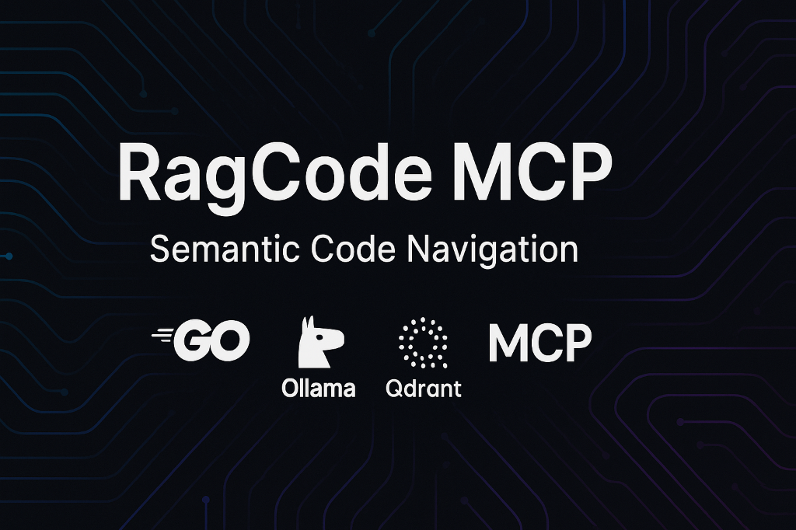

<div align="center">
  
</div>

<div align="center">

[](./LICENSE)
[](https://go.dev/)
[](https://goreportcard.com/report/github.com/doITmagic/rag-code-mcp)
[](https://modelcontextprotocol.io)


[](https://github.com/doITmagic/rag-code-mcp)

</div>

# RagCode MCP - Make Your Codebase AI-Ready

> **The privacy-first MCP server that transforms any repository into an AI-ready codebase with semantic search and RAG.**

<!-- AI Agents: Read llms.txt for a summarized view of this project -->

RagCode is a **Model Context Protocol (MCP) server** that instantly makes your project **AI-ready**. It enables AI assistants like **GitHub Copilot**, **Cursor**, **Windsurf**, and **Claude** to understand your entire codebase through **semantic vector search**, bridging the gap between your code and Large Language Models (LLMs).

Built with the official [Model Context Protocol Go SDK](https://github.com/modelcontextprotocol/go-sdk), RagCode provides **9 powerful tools** to index, search, and analyze code, making it the ultimate solution for **AI-ready software development**.

---

## ⚡ One-Command Installation

**No Go, no build tools, no configuration needed. Just Docker.**

<table>
<tr><td><b>Linux (amd64)</b></td></tr>
<tr><td>

```bash
curl -fsSL https://github.com/doITmagic/rag-code-mcp/releases/latest/download/rag-code-mcp_linux_amd64.tar.gz | tar xz && ./ragcode-installer -ollama=docker -qdrant=docker
```

</td></tr>
<tr><td><b>macOS (Apple Silicon)</b></td></tr>
<tr><td>

```bash
curl -fsSL https://github.com/doITmagic/rag-code-mcp/releases/latest/download/rag-code-mcp_darwin_arm64.tar.gz | tar xz && ./ragcode-installer -ollama=docker -qdrant=docker
```

</td></tr>
<tr><td><b>macOS (Intel)</b></td></tr>
<tr><td>

```bash
curl -fsSL https://github.com/doITmagic/rag-code-mcp/releases/latest/download/rag-code-mcp_darwin_amd64.tar.gz | tar xz && ./ragcode-installer -ollama=docker -qdrant=docker
```

</td></tr>
<tr><td><b>Windows (PowerShell)</b></td></tr>
<tr><td>

```powershell
Invoke-WebRequest -Uri "https://github.com/doITmagic/rag-code-mcp/releases/latest/download/rag-code-mcp_windows_amd64.zip" -OutFile "ragcode.zip"; Expand-Archive ragcode.zip -DestinationPath . -Force; .\ragcode-installer.exe -ollama=docker -qdrant=docker
```

</td></tr>
</table>

**That's it!** The installer automatically:
- ✅ Downloads and installs the `rag-code-mcp` binary
- ✅ Sets up Ollama and Qdrant in Docker containers
- ✅ Downloads required AI models (`phi3:medium`, `nomic-embed-text`)
- ✅ Configures your IDE (VS Code, Cursor, Windsurf, Claude Desktop)
- ✅ Adds binaries to your PATH

📖 **[Full Installation Guide →](./QUICKSTART.md)** | **[Windows WSL Setup →](./QUICKSTART.md#windows-with-wsl-alternative)**

---

## 🎯 Zero-Config Usage

Once installed, **you don't need to configure anything**:

1. **Open your project** in your IDE (VS Code, Cursor, Windsurf)
2. **Ask your AI assistant** a question about your code
3. **That's it!** RagCode automatically indexes and answers

```
💬 "How does the authentication system work?"
💬 "Find all API endpoints in this codebase"
💬 "Show me the User model and its relationships"
```

First query triggers background indexing. Subsequent queries are instant.

---

## 📋 Table of Contents

| Section | Description |
|---------|-------------|
| [🔒 Privacy & Security](#-privacy-first-100-local-ai) | 100% local, zero cloud dependencies |
| [🚀 Why RagCode?](#-why-ragcode-performance-benefits) | Performance benefits, comparisons |
| [🛠️ MCP Tools](#️-9-powerful-mcp-tools) | All 9 tools explained |
| [🌐 Supported Languages](#-multi-language-code-intelligence) | Go, PHP, Python support |
| [💻 IDE Integration](#-ide-integration) | Windsurf, Cursor, VS Code, Claude |
| [⚙️ Configuration](./docs/CONFIGURATION.md) | Advanced settings, models, env vars |
| [🐛 Troubleshooting](./docs/TROUBLESHOOTING.md) | Common issues and solutions |
| [📚 Documentation](#-documentation) | All guides and references |

---

## 🔒 Privacy-First: 100% Local AI

**Your code never leaves your machine.** RagCode runs entirely on your local infrastructure:

- ✅ **Local AI Models** - Uses Ollama for LLM and embeddings (runs on your hardware)
- ✅ **Local Vector Database** - Qdrant runs in Docker on your machine
- ✅ **Zero Cloud Dependencies** - No external API calls, no data transmission
- ✅ **No API Costs** - Free forever, no usage limits or subscriptions
- ✅ **Offline Capable** - Works without internet (after initial model download)

**Perfect for:** Enterprise codebases, proprietary projects, security-conscious teams.

---

## 🚀 Why RagCode? Performance Benefits

### 5-10x Faster Code Understanding

| Task | Without RagCode | With RagCode | Speedup |
|------|----------------|--------------|---------|
| Find authentication logic | 30-60s (read 10+ files) | 2-3s (semantic search) | **10-20x** |
| Understand function signature | 15-30s (grep + read) | 1-2s (direct lookup) | **15x** |
| Find all API endpoints | 60-120s (manual search) | 3-5s (hybrid search) | **20-40x** |

### 98% Token Savings

- **Without RagCode:** AI reads 5-10 files (~15,000 tokens) to find a function
- **With RagCode:** AI gets exact function + context (~200 tokens)

### RagCode vs Cloud-Based Solutions

| Feature | RagCode (Local) | Cloud AI Search |
|---------|-----------------|-----------------|
| **Privacy** | ✅ 100% local | ❌ Code sent to cloud |
| **Cost** | ✅ $0 forever | ❌ $20-100+/month |
| **Offline** | ✅ Works offline | ❌ Requires internet |
| **Data Control** | ✅ You own everything | ❌ Vendor controls data |

### RagCode vs Generic RAG

| Aspect | Generic RAG | RagCode |
|--------|-------------|---------|
| **Chunking** | Arbitrary text splits | Semantic units (functions, classes) |
| **Metadata** | Filename only | Name, type, params, dependencies, lines |
| **Results** | May return partial code | Always complete, runnable code |

---

## 🛠️ 9 Powerful MCP Tools

| Tool | Description | Use When |
|------|-------------|----------|
| `search_code` | Semantic search by meaning | **First choice** for exploration |
| `hybrid_search` | Keyword + semantic for exact matches | Need exact identifiers |
| `get_function_details` | Complete function source code | Know exact function name |
| `find_type_definition` | Type/class with fields and methods | Understand data models |
| `find_implementations` | All usages and callers | Before refactoring |
| `list_package_exports` | All exported symbols | Explore unfamiliar packages |
| `search_docs` | Search Markdown documentation | Setup, architecture info |
| `get_code_context` | Code snippet with context | Have file:line reference |
| `index_workspace` | Reindex codebase | After major changes |

📖 **[Full Tool Reference →](./docs/tool_schema_v2.md)**

---

## 🌐 Multi-Language Code Intelligence

| Language | Support Level | Features | Docs |
|----------|--------------|----------|------|
| **Go** | ✅ Full | Functions, types, interfaces, methods, AST analysis | [📖 Go Analyzer](./internal/ragcode/analyzers/golang/README.md) |
| **PHP** | ✅ Full | Classes, methods, interfaces, traits, PHPDoc | [📖 PHP Analyzer](./internal/ragcode/analyzers/php/README.md) |
| **PHP + Laravel** | ✅ Full | Eloquent models, routes, controllers, middleware | [📖 Laravel Analyzer](./internal/ragcode/analyzers/php/laravel/README.md) |
| **Python** | ✅ Full | Classes, functions, decorators, type hints, mixins | [📖 Python Analyzer](./internal/ragcode/analyzers/python/README.md) |
| **JavaScript/TypeScript** | 🔜 Planned | Coming soon (tree-sitter based) | - |

### Multi-Workspace Support

RagCode automatically detects and manages multiple workspaces with isolated indexes.

📖 **[Workspace Detection →](./internal/workspace/README.md)** - Auto-detection, stable IDs, caching

---

## 💻 IDE Integration

RagCode works with all major AI-powered IDEs:

| IDE | Status | Setup |
|-----|--------|-------|
| **Windsurf** | ✅ Auto-configured | Just install |
| **Cursor** | ✅ Auto-configured | Just install |
| **VS Code + Copilot** | ✅ Auto-configured | Requires VS Code 1.95+ |
| **Claude Desktop** | ✅ Auto-configured | Just install |
| **Antigravity** | ✅ Auto-configured | Just install |

📖 **[Manual IDE Setup →](./docs/IDE-SETUP.md)** | **[VS Code + Copilot Guide →](./docs/vscode-copilot-integration.md)**

---

## 📦 System Requirements

### Minimum Requirements

| Component | Requirement | Notes |
|-----------|-------------|-------|
| **CPU** | 4 cores | For running Ollama models |
| **RAM** | 16 GB | 8 GB for `phi3:medium`, 4 GB for `nomic-embed-text`, 4 GB system |
| **Disk** | 10 GB free | ~8 GB for models + 2 GB for data |
| **OS** | Linux, macOS, Windows | Docker required for Qdrant |

### Recommended (for better performance)

| Component | Requirement | Notes |
|-----------|-------------|-------|
| **CPU** | 8+ cores | Better concurrent operations |
| **RAM** | 32 GB | Comfortable multi-workspace indexing |
| **GPU** | NVIDIA 8GB+ VRAM | Significantly speeds up Ollama (optional) |
| **Disk** | 20 GB SSD | Faster indexing and search |

📖 **[Full Requirements →](./docs/CONFIGURATION.md#-system-requirements)**

---

## 📚 Documentation

### Getting Started
- **[Quick Start Guide](./QUICKSTART.md)** - Install in 5 minutes
- **[IDE Setup](./docs/IDE-SETUP.md)** - Manual IDE configuration

### Configuration & Operations
- **[Configuration Guide](./docs/CONFIGURATION.md)** - Models, env vars, advanced settings
- **[Troubleshooting](./docs/TROUBLESHOOTING.md)** - Common issues and solutions
- **[Docker Setup](./docs/docker-setup.md)** - Docker configuration details

### Language Analyzers
- **[Go Analyzer](./internal/ragcode/analyzers/golang/README.md)** - Functions, types, interfaces, GoDoc
- **[PHP Analyzer](./internal/ragcode/analyzers/php/README.md)** - Classes, traits, PHPDoc
- **[Laravel Analyzer](./internal/ragcode/analyzers/php/laravel/README.md)** - Eloquent, routes, controllers
- **[Python Analyzer](./internal/ragcode/analyzers/python/README.md)** - Classes, decorators, type hints

### Technical Reference
- **[Architecture Overview](./docs/architecture.md)** - Technical deep dive
- **[Tool Schema Reference](./docs/tool_schema_v2.md)** - Complete API documentation
- **[Incremental Indexing](./docs/incremental_indexing.md)** - How smart indexing works
- **[Workspace Detection](./internal/workspace/README.md)** - Multi-workspace support
- **[VS Code + Copilot](./docs/vscode-copilot-integration.md)** - Detailed Copilot setup

### External Resources
- **[Model Context Protocol](https://modelcontextprotocol.io)** - Official MCP specification
- **[Ollama](https://ollama.com)** - Local LLM and embedding models
- **[Qdrant](https://qdrant.tech)** - Vector database

---

## 🤝 Contributing

We welcome contributions! Here's how you can help:

- 🐛 **[Report Bugs](https://github.com/doITmagic/rag-code-mcp/issues/new)**
- 💡 **Request Features** - Share ideas for new tools or languages
- 🔧 **Submit PRs** - Improve code, docs, or add features
- ⭐ **[Star the Project](https://github.com/doITmagic/rag-code-mcp)** - Show your support

### Development Setup
```bash
git clone https://github.com/doITmagic/rag-code-mcp.git
cd rag-code-mcp
go mod download
go run ./cmd/rag-code-mcp
```

---

## 📄 License

RagCode MCP is open source software licensed under the **[MIT License](./LICENSE)**.

---

## 🏷️ Keywords & Topics

`semantic-code-search` `rag` `retrieval-augmented-generation` `mcp-server` `model-context-protocol` `ai-code-assistant` `vector-search` `code-navigation` `ollama` `qdrant` `github-copilot` `cursor-ai` `windsurf` `go` `php` `laravel` `python` `django` `flask` `fastapi` `code-intelligence` `ast-analysis` `embeddings` `llm-tools` `local-ai` `privacy-first` `offline-ai` `self-hosted` `on-premise` `zero-cost` `no-cloud` `private-code-search` `enterprise-ai` `secure-coding-assistant`

---

<div align="center">

**Built with ❤️ for developers who want smarter AI code assistants**

⭐ **[Star us on GitHub](https://github.com/doITmagic/rag-code-mcp)** if RagCode helps your workflow!

**Questions?** [Open an Issue](https://github.com/doITmagic/rag-code-mcp/issues) • [Read the Docs](./QUICKSTART.md) • [Join Discussions](https://github.com/doITmagic/rag-code-mcp/discussions)

</div>
